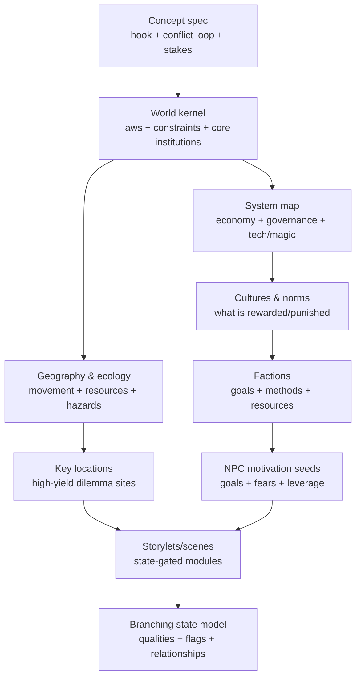
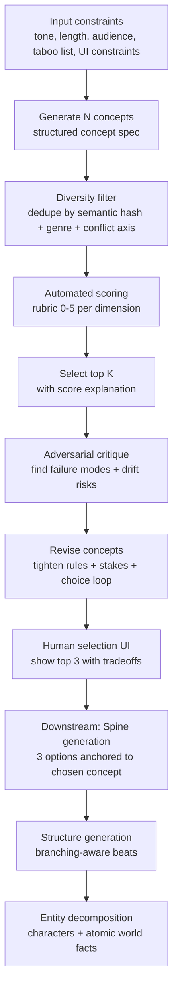

# Compelling Narrative Concepts and Concept-Derived Worldbuilding for LLM-Driven Branching Interactive Stories

## Executive summary

A “compelling narrative concept” is not a plot outline. It is a generative engine: a compact set of tensions (stakes + constraints + a core conflict) that *keeps producing dramatizable situations* as the player makes choices. In interactive formats, the concept must do more work than in linear fiction: it must repeatedly convert player agency into meaningful show-your-work consequences and renewed dilemmas rather than collapsing into either randomness or railroading. This aligns with established game-design accounts of *meaningful play* as the discernable, integrated relationship between player action and system outcome. citeturn15view2

Key design implication: for branching interactive stories, a “good concept” is one that naturally yields (a) a repeatable decision loop, (b) a manageable state space, and (c) a robust storyworld model that supports consistent causal consequences. This is consistent with interactive narrative research that distinguishes approaches along a spectrum between “strong story” (tight authorial structure) and “strong autonomy” (emergent character/world simulation), and warns that balancing structure with player-driven variability is the central challenge. citeturn4search21turn4search5turn12view0

This report proposes a practical, rigorous scoring rubric across eleven dimensions (hooks, novelty, stakes/constraints, agency, genre signaling, scalability, replayability, and LLM feasibility), plus acceptance thresholds suitable for an LLM-driven browser app. It also proposes a systematic method to derive worldbuilding from a chosen concept using a dependency-ordered “world kernel → world systems → social/institutional mesh → content edges (NPCs, locations, storylets)” pipeline. This approach is grounded in narrative theory (plot as causal action; storyworld/possible-worlds models) and game narrative scholarship emphasizing worlds and spaces as “narrative architecture.” citeturn2search4turn5search9turn7search0turn18search0

Implementation note: your current production pipeline already contains several strong building blocks: a **Spine** step that formalizes dramatic question, need vs want, antagonistic force, and conflict axis; a **Structure** step that demands branching-aware beats and a page-range pacing budget; and an **Entity Decomposer** step that atomizes world facts into domain-tagged, epistemically typed propositions for downstream controllability. fileciteturn0file1 fileciteturn0file3 fileciteturn0file0  
What’s missing upstream is a *concept generation + evaluation harness* that reliably yields candidates optimized for branching and LLM controllability before you show users 3 spine options.

Unspecified constraints: target audience age, content rating, and preferred genres are unspecified in the request and are treated as open-ended. (Your shipped prompts currently assume an adults-only content policy; treat that as a configurable product decision rather than a universal design requirement.) fileciteturn0file1

## Terminology and what a narrative concept is

### Narrative concept vs. premise vs. plot vs. theme

A useful way to keep these terms non-confused is to define them by **level of abstraction** and **what they generate**:

- **Narrative concept**: the *generative dramatic engine*—a compact specification of the *situation-space* that keeps producing conflicts, reversals, and choices. For interactive stories, the concept also implies the “choice loop” and what kinds of player actions matter. This maps well to “high concept” discourse in film studies: a concept that can be expressed as a succinct, marketable, graspable core—often a “one-line concept”—but for interactive use, it must also be systemically fertile, not just pitchable. citeturn17view2
- **Premise**: typically a *proposition about a character-in-conflict* (often including a moral/causal claim). It is narrower than a narrative concept because it tends to predict an *arc direction* (what kind of outcome or transformation follows from the setup). citeturn2search15turn2search3
- **Plot**: the *arrangement of events and actions* (and the causal/temporal logic connecting them). Narratology treats plot as an organizing principle that sits between raw story-events and discourse presentation; it highlights how event sequences and character actions are demonstrated as motivated and consequential. citeturn18search0turn2search4
- **Theme**: the *meaning-layer*—the core ideas/values/questions that the story explores through plot and character choices. Theme is usually not directly playable; it becomes playable when you translate it into dilemmas with consequences (theme-as-pressure). citeturn2search4turn8search9

A minimal but practical operational definition for your app:

> A narrative concept is the smallest description that still implies (1) a repeatable decision loop, (2) a pressure mechanism that forces tradeoffs, and (3) a storyworld model capable of producing consistent consequences.

That pressure mechanism idea is already explicit in your spine schema (“pressureMechanism” for the antagonistic force). fileciteturn0file1

### A compact “concept spec” that is branching- and LLM-friendly

To prevent concepts that sound good but collapse in branching generation, represent each concept candidate as a structured object (even if the user sees prose). The following fields are the ones that most reliably predict downstream success in interactive narrative systems:

- **Hook sentence** (one line) + **elevator paragraph** (≤120 words)
- **Protagonist role** (not name) + **core competence** + **core flaw**
- **Goal** (outer want) + **need** (inner change) + relationship between them
- **Antagonistic force** + **pressure mechanism** (how it forces tradeoffs)
- **Stakes** (personal + social/systemic) + **deadline/clock**
- **Constraints** (what actions are costly/forbidden/impossible and why)
- **Choice loop** (recurring decision pattern: *do X at cost Y vs do Z at cost W*)
- **World rule kernel** (2–5 axioms that make outcomes legible)
- **Branching posture** (wide, narrow, hub-and-spoke, storylet/quality-based)
- **LLM control plan** (what must be *state*, what can be *free text*)

This echoes two established lines of work: (a) interactive narrative scholarship emphasizing agency as the pleasure of meaningful action with visible results, and (b) game design frameworks that separate mechanics/dynamics/aesthetics to manage the relationship between system rules and player experience. citeturn0search21turn15view2turn11view2

## Dimensions of a compelling narrative concept

Each dimension below includes: explanation, diagnostic questions, brief examples, and measurable heuristics/rubrics. Scores are designed to be machine- and human-usable (0–5 unless noted). Examples are illustrative, not prescriptive.

### Definition clarity and conceptual identity

**Explanation**  
A concept is compelling when it is *quickly graspable* yet still implies a large space of meaningful situations. Film “high concept” discourse highlights the advantage of a concept that can be reduced to a clean, communicable core; but interactive storytelling requires the additional property that the core implies *repeatable decision structures*, not just a striking setup. citeturn17view2turn15view2

**Diagnostic questions**
- Can you state the concept in one sentence without proper nouns, and does it still feel specific?
- What is the *recurring* conflict pattern, not just the inciting event?
- Could you generate ten distinct scenes that all feel like “this concept” without inventing new rules?
- What would a player *do* repeatedly, and what would they *risk* repeatedly?

**Examples (brief)**
- entity["movie","Groundhog Day","1993 film"]: the concept itself (“relive the same day”) implies iterative experimentation and consequence learning—structurally sympathetic to replay. citeturn7search15
- entity["video_game","Façade","interactive drama 2005"]: the concept (“walk into a couple’s relationship crisis and affect outcomes”) is inherently about socially charged choices and replayable variation. citeturn4search5turn4search13
- entity["book_series","The Hunger Games","Suzanne Collins"]: the concept (“televised survival contest plus political oppression”) contains a built-in pressure mechanism and systemic stakes. citeturn7search0

**Scoring rubric (0–5)**
- **0**: vague (“a hero saves the world”); cannot predict playable decisions.
- **1**: clear setting, unclear conflict loop; relies on plot inventions to hint at gameplay.
- **2**: clear hook, but only supports a narrow set of scenes.
- **3**: clear hook + at least one repeatable decision loop.
- **4**: one-line clarity + multiple decision loops + visible pressure mechanism.
- **5**: “inevitable engine”: you can generate many situations and choices from the concept alone with minimal new rules.

Measurable heuristic: **Logline completeness**. Score 1 point each if the one-line concept contains: protagonist role, goal, antagonistic force, stakes, key constraint. (≥4/5 strongly predicts downstream coherence.)

### Cognitive hooks and emotional hooks

**Explanation**  
Compelling concepts exploit predictable cognitive motivators: curiosity (information gaps), narrative transportation (immersion), and social/empathic simulation (modeling other minds). Curiosity research argues that attention spikes when an “information gap” becomes salient—i.e., the player can name what they don’t know. citeturn0search6turn0search22  
Transportation research describes immersion as a combined cognitive/emotional/imagery focus on the narrative world, with downstream effects on enjoyment and persuasion. citeturn1search4turn1search12  
Fiction-as-simulation accounts frame narrative engagement as running social-emotional models; this matters for interactive stories because choices feel meaningful when they alter relationships, reputations, and moral self-concept. citeturn8search8turn8search9

**Diagnostic questions**
- What is the first “information gap” the player will feel within 30 seconds?
- What emotion is the concept *primed* to evoke (dread, awe, tenderness, indignation)?
- Which relationships are inherently stressed by the concept (family, duty, loyalty, romance)?
- What is the “emotional verb” of play: *confess, betray, rescue, endure, outwit, forgive*?

**Examples (brief)**
- entity["movie","Alien","1979 film"]: immediate visceral stakes + unknown predator behavior creates a strong information-gap loop (what is it, where is it, how do we survive). citeturn0search6turn16view2
- The Hunger Games: empathy + moral stress (survive vs remain humane) produces durable emotional engagement. citeturn8search9turn7search0
- Façade: social discomfort and relationship repair/destruction leverages empathy and theory-of-mind processing. citeturn4search5turn8search0

**Scoring rubric (0–5)**
- **0**: no clear curiosity target; emotions depend on writing polish only.
- **1**: has a mystery but no personal/emotional stake.
- **2**: has emotion but no clear information gaps to pull the player forward.
- **3**: clear early gap + clear emotional target.
- **4**: multiple layered gaps (world, character, moral) + strong emotion.
- **5**: hook stack: curiosity + empathy + threat/hope, all implied by concept.

Measurable heuristics:
- **Hook latency**: can the concept produce a compelling first-choice within **≤ 300 generated tokens** (roughly one short screen of text)? If not, expect drop-off (LLM pacing and user patience).
- **Gap count**: count distinct unanswered questions implied by the concept’s first paragraph; target **3–5** (0–2 is flat; >6 often becomes noise). citeturn0search6

### Novelty vs familiarity balance

**Explanation**  
Compelling concepts often sit on an “optimal novelty” curve: too familiar feels redundant; too novel becomes hard to parse. Classic curiosity/interest work reviews collative variables (novelty, complexity, uncertainty, conflict) and links preference to an inverted-U relationship. citeturn1search6turn1search10  
Separate psychology work on mere exposure shows that familiarity alone can increase liking, meaning genre tropes can be assets if combined with a differentiator. citeturn1search13  
Genre theory likewise emphasizes repetition + difference as a functional economic/audience mechanism (familiar expectations plus variation). citeturn6search17turn6search4

**Diagnostic questions**
- What is the concept’s *dominant familiar frame* (e.g., heist, romance, survival)?
- What is the single most legible differentiator (“same but different”)?
- If you removed the differentiator, would the concept still be viable? If yes, it’s probably too generic.
- If you removed the familiar frame, would anyone know how to play/expect? If no, you may be too weird.

**Examples (brief)**
- Groundhog Day: familiar “character comedy” frame with a high novelty rule (“time loop”) that becomes a learnable system. citeturn1search10turn7search15
- Alien: familiar “crew-on-a-ship” structure with a novel horror pressure-cooker and creature rules. citeturn1search6turn16view2
- entity["video_game","Disco Elysium","2019 video game"]: familiar detective frame plus unusual internalized skill-voices and political/psychological intensity (difference). citeturn7search15turn11view2

**Scoring rubric (0–5)**
- **0**: pure pastiche or incoherent novelty.
- **1**: generic genre reenactment with a cosmetic twist.
- **2**: notable twist, but conflicts with audience parsing (hard to “enter”).
- **3**: familiar frame + clear differentiator.
- **4**: differentiator changes what choices mean (not just aesthetics).
- **5**: distinctive + instantly legible; twist is structurally load-bearing.

Measurable heuristic: **Novelty leverage ratio**  
Estimate: (number of mechanics/choice-implications produced by differentiator) / (number of world/plot elements required to explain differentiator). Target **≥ 1.5**. If a twist needs a lot of lore to explain but barely changes play, it’s a bad twist for LLM branching.

### Stakes, constraints, and core conflict

**Explanation**  
Conflict becomes story when it forces consequential action under constraints. Classical theory emphasizes plot/action as central—events matter because choices and consequences form a causal chain. citeturn2search4turn18search0  
In games, meaningful play requires discernable and integrated action–outcome relations; stakes and constraints are what make outcomes meaningful rather than arbitrary. citeturn15view2

**Diagnostic questions**
- What *cannot* happen in this world, and what *must* happen if the player fails?
- What is the “pressure mechanism” that turns time into urgency and choices into tradeoffs?
- What is the smallest scene that still contains the conflict?
- Are there at least two credible strategies the player can pursue—and are they in tension?

**Examples (brief)**
- Alien: hard constraints (closed environment, limited resources, unknown threat) plus high stakes (survival). citeturn1search6turn16view2
- The Hunger Games: systemic constraint (authoritarian spectacle) plus personal stakes (life, loved ones) plus moral stakes (identity). citeturn7search0turn8search9
- Façade: constraints are social (norms, conversational timing) and stakes are relational (marriage outcome, player’s social role), which is exactly what drama management systems attempt to preserve. citeturn4search13turn4search5

**Scoring rubric (0–5)**
- **0**: low consequence; any choice works.
- **1**: stakes mentioned but not mechanically enforced hints (no cost model).
- **2**: stakes exist but constraints are fuzzy (player can “do anything”).
- **3**: clear stakes + at least one hard constraint that shapes choices.
- **4**: layered stakes (personal/social/moral) + multiple constraints.
- **5**: pressure cooker: constraints reliably force tradeoffs scene after scene.

Measurable heuristics:
- **Constraint count**: number of independent constraints affecting choices (law, resources, time, ethics, relationship). Target **3–5**.
- **Stakes ladder**: at least **2 tiers** (personal + systemic) present in concept spec.

### Protagonist, antagonist, and agency

**Explanation**  
A strong interactive concept defines *who the player is* in the world: not just a personality, but a role with affordances and vulnerabilities. Agency is not “freedom”; it is the pleasure of meaningful action with observable outcomes. citeturn0search21turn15view2  
Interactive drama research frames the challenge as letting the player act while still maintaining coherent dramatic structure; “drama management” exists to reconcile local player actions with global story arcs. citeturn4search13turn4search5

**Diagnostic questions**
- What is the player-role’s unique leverage in the setting (status, skill, access)?
- What does the antagonistic force *want*, and why can’t it ignore the protagonist?
- If the player refuses the “main plot,” does the world push back in interesting ways?
- What kinds of actions are *meaningful* in this concept: talk, steal, fight, investigate, nurture?

**Examples (brief)**
- Façade: the player’s agency is conversational/social; the drama manager sequences beats to preserve a coherent arc while responding. citeturn4search13turn4search5
- Detroit: Become Human: explicit branching structure and replay encourages exploring agency outcomes. citeturn7search15turn3search13
- Disco Elysium: agency is largely interpretive and social; choices often reshape internal states, relationships, and worldview. citeturn11view2turn7search15

**Scoring rubric (0–5)**
- **0**: protagonist is a camera; antagonist is vague; no actionable verbs.
- **1**: protagonist exists but lacks leverage; antagonist is “evil” without mechanism.
- **2**: clear role but agency collapses to one dominant solution.
- **3**: role implies multiple verbs + antagonist applies pressure.
- **4**: role has *distinct* strategies with costs; antagonist adapts.
- **5**: agency is structural: every major action type has meaningful consequences.

Measurable heuristic: **Verb palette breadth**  
List action verbs supported by the concept (e.g., negotiate, investigate, sabotage, protect, prove, escape). Target **≥ 6** verbs with distinct state impacts.

### Setting as a concept seed

**Explanation**  
In interactive media, setting is not backdrop; it is a constraint machine and a possibility space. Game narrative scholarship argues that designers often function as “narrative architects,” shaping spaces and worlds that scaffold story experiences. citeturn7search0turn7search4  
Worldbuilding theory also treats imaginary worlds as entities with their own logic (“subcreation”), and possible-worlds/storyworld approaches emphasize consistency conditions that maintain belief and enable counterfactual reasoning—crucial when players branch the narrative. citeturn5search0turn5search9

**Diagnostic questions**
- What is the setting’s *rule-kernel* (2–5 axioms) that makes it unlike generic fantasy/sci-fi?
- Which locations naturally create dilemmas (border checkpoints, sacred sites, black markets)?
- What “everyday life” details will keep the world from feeling procedural and empty?
- What does the world *reward* and *punish*?

**Examples (brief)**
- The “storylets/qualities” approach in narrative design (common in systems-led interactive fiction) treats world state as a set of qualities unlocking content, turning setting into the gating logic. citeturn4search6turn4search2
- Jenkins’ “environmental storytelling” tradition: spaces can contain narrative information and afford narrative discovery. citeturn7search0

**Scoring rubric (0–5)**
- **0**: generic setting; could be swapped with no impact.
- **1**: distinctive aesthetics, but rules do not change choices.
- **2**: a few rules exist, but don’t propagate consequences.
- **3**: rules shape multiple dilemmas; locations imply conflict.
- **4**: setting generates stories (institutions, scarcity, taboos).
- **5**: setting is inseparable from concept; it is a story engine.

Measurable heuristic: **Setting–choice coupling**  
For each of 5 major setting facts, can you derive at least 2 unique choice consequences? Target **≥ 10** consequences total.

### Genre signals and subversion

**Explanation**  
Genre is not just taxonomy; it is a social contract that shapes expectations and interpretation. Film/literary genre theory distinguishes semantic elements (icons, settings, props) and syntactic elements (relationships, structures) and treats genres as dynamic, historically determined processes rather than static rules. citeturn6search4turn6search18  
Genre typically depends on “repetition and difference”—familiarity plus novelty. citeturn6search17turn1search13

**Diagnostic questions**
- What will players recognize immediately as genre cues, within the first “screen”?
- What does this genre promise the player (mystery = answers; horror = dread; romance = intimacy)?
- If you subvert a convention, what replaces it so the player still feels oriented?
- Do your mechanics match your genre aesthetics (e.g., horror needs vulnerability and uncertainty)?

**Examples (brief)**
- Alien: horror syntax (vulnerability, escalating threat) plus sci-fi semantics (space, tech). citeturn6search4turn16view2
- Disco Elysium: detective semantics with a subversive syntactic emphasis on interiority and political ideology hints. citeturn6search4turn7search15
- Detroit: Become Human: cinematic branching drama with explicit flowchart feedback encourages genre-as-replay structure. citeturn3search13turn7search15

**Scoring rubric (0–5)**
- **0**: incoherent genre; audience can’t predict what “winning” means.
- **1**: genre aesthetics without genre payoffs.
- **2**: genre is clear but rigid; few surprises.
- **3**: genre promises are met; subversions are limited but meaningful.
- **4**: subversion creates new dilemmas rather than confusion.
- **5**: genre is weaponized: expectations become part of the drama.

Measurable heuristic: **Promise–payoff mapping**  
List top 3 genre promises and the planned payoff mechanisms (reveal types, setpieces, relationship beats). Require **≥ 1 payoff mechanism per promise** in the concept spec.

### Scalability for branching interactive formats

**Explanation**  
Branching narratives face combinatorial explosion if treated as a literal tree. Interactive narrative practice often shifts from pure branching to structures like storylets, hub-and-spoke, or quality-based unlock systems where state gates content and branches can reconverge. Emily Short’s analysis of “beyond branching” highlights quality-based and salience-based structures as more scalable than naive branches. citeturn4search6turn4search2  
Computational interactive narrative research similarly categorizes system approaches and weighs coherence vs autonomy. citeturn4search21turn1search3

**Diagnostic questions**
- What is the intended branching posture: tree, reconverging, storylet lattice, or simulation/emergent?
- What is the minimal state representation that determines future availability (qualities, flags, relationships)?
- Where can branches reconverge without feeling fake?
- How will you keep causal coherence when players do unexpected things?

**Examples (brief)**
- Detroit: Become Human explicitly surfaces reconverging branches via chapter flowcharts, supporting replay and exploration. citeturn7search15turn3search13
- Façade organizes interaction into beat sequences under drama management constraints; it aims for high agency while preserving arc coherence. citeturn4search13turn4search5
- Quality-based narrative/storylets: content selection driven by state qualities, enabling combinatorial recombination without a full tree. citeturn4search6

**Scoring rubric (0–5)**
- **0**: concept requires unique bespoke scenes for every choice.
- **1**: scales only with heavy authorial labor; no reconvergence plan.
- **2**: some reconvergence but concept relies on “illusion of choice.”
- **3**: clear state-gated structure; reconvergence points exist.
- **4**: concept implies modular episodes; state variables are compact.
- **5**: concept thrives on recombination; storylets + state create emergent arcs.

Measurable heuristics:
- **State variable budget**: target **8–20** core state variables for a 15–50 page experience (your current structure prompt targets this scale). fileciteturn0file3  
- **Branch factor discipline**: per scene, target **2–4** choices; more often reduces meaning or explodes state.

### Player choice integration

**Explanation**  
Player choice must be *meaningful*, not decorative. In Rules of Play, meaningful play is defined (evaluatively) as action–outcome relationships that are discernable and integrated into the larger context of the game. citeturn15view2  
Designing “interesting decisions” typically requires tradeoffs and uncertainty; systems-led narrative design (e.g., storylets) treats choices as interactions with a stateful world model rather than as branching plot forks. citeturn6search23turn4search6

**Diagnostic questions**
- For each major choice, what is gained and what is risked (tradeoff clarity)?
- Will the player see consequences soon enough to learn the system?
- Does every choice change at least one tracked state variable?
- Can two choices lead to *different kinds of future problems*, not just different text?

**Examples (brief)**
- Storylet-based structures explicitly model prerequisites and outcomes, making choices legible within a state framework. citeturn4search6
- Façade: choices are conversational actions that can shift relationship tension and beat sequencing. citeturn4search13turn4search5

**Scoring rubric (0–5)**
- **0**: choices are cosmetic (tone-only dialogue).
- **1**: choices affect immediate text but not future.
- **2**: some future effects, but opaque or inconsistent.
- **3**: choices produce discernable short-term effects and at least one long-term consequence.
- **4**: choices create strategic posture (alliances, resources, reputation).
- **5**: choices reshape the problem space; future dilemmas differ qualitatively.

Measurable heuristics:
- **State impact rate**: ≥ **80%** of presented choices must modify at least one tracked variable.
- **Consequence lag**: ≥ **50%** of choices should have a visible consequence within **1 scene**; the rest can be long-tail.

### Replayability and emergent drama

**Explanation**  
Replayability in branching stories comes from (a) genuinely different outcomes, (b) different strategies leading to different experiences, and (c) emergent social dynamics. Research on branching narrative play highlights replay motivated by exploring alternative paths and outcomes, especially when the structure makes those alternatives visible. citeturn7search15turn3search13  
On the simulation/emergence side, “generative agents” research shows how memory, reflection, and planning mechanisms can yield believable individual and emergent social behaviors from minimal seeds—suggesting a path toward replayable drama that isn’t purely authored branching. citeturn3search2turn3search10

**Diagnostic questions**
- What is the replay promise? (new endings, new revelations, new relationships, new strategies)
- Which state variables create “phase changes” in the story (e.g., faction allegiance flips)?
- Can the same opening lead to materially different midgame problems?
- Do NPCs have agendas that can collide in different configurations?

**Examples (brief)**
- Detroit: Become Human: replay is explicitly oriented around exploring flowchart alternatives and consequences. citeturn7search15
- Façade: replay by altering interaction patterns to change the couple’s outcomes (interactive drama as replay engine). citeturn4search5turn4search13
- The Sims: a sandbox structured for emergent narrative, explicitly used as an inspiration in generative-agent simulation research. citeturn3search10

**Scoring rubric (0–5)**
- **0**: single-path concept; replay is pointless.
- **1**: superficial variation only.
- **2**: alternate endings exist but most of the run is identical.
- **3**: at least two distinct arcs with different midgame beats.
- **4**: multiple strategies produce different relationships/resources/problems.
- **5**: replay emerges naturally from system interactions; outcomes feel authored but are reconfigurable.

Measurable heuristics:
- **Distinct-run ratio**: estimate percent of content that differs between two reasonable playthrough strategies; target **≥ 35%** for “replayable,” **≥ 50%** for “highly replayable.”
- **Ending spread**: ≥ **4** meaningfully different ending states for 15–50 pages.

### Feasibility for LLM generation: promptability, token budget, controllability

**Explanation**  
LLM-driven interactive narratives fail in predictable ways: drift, contradiction, spatiotemporal inconsistency, and loss of constraints under long context. A recent plan-driven framework for controllable interactive narrative explicitly identifies “spatiotemporal distortion” as a core failure mode and proposes structuring narratives into “cells” with explicit plans to resist drift while adapting to variable user inputs. citeturn11view0turn10search2  
Long-context research shows models can underuse or “lose” relevant information when it sits in the middle of long prompts—performance is often highest when key facts are near the beginning or end—so relying on giant story bibles in-context is fragile. citeturn10search4  
Explorations comparing retrieval-augmented generation (RAG) with long-context models suggest hybrid approaches can be preferable in practice; this supports storing canon/state in structured retrieval rather than swelling prompts. citeturn10search3  
LLM evaluation research and tools also increasingly emphasize iterative prompt refinement and rubric-based judging as part of production workflows. citeturn3search12turn9search1

**Diagnostic questions**
- Can the concept be enforced with **≤ 20** canonical “laws/norms” without losing its identity?
- What must be hard-coded state vs soft narrative flavor?
- Will the concept force the model to maintain complex logistics (hard), or can it be cell-planned (easier)?
- Can NPC goals be represented as short structured agendas rather than prose backstory?

**Examples (brief)**
- Plan-and-cell approaches: a narrative can be partitioned into locally controlled units with explicit spatiotemporal plans to preserve coherence under interactive variance. citeturn11view0
- “Memory + reflection + planning” agent architectures: storing experiences externally and retrieving relevant memories improves consistency and believability in simulations. citeturn3search2turn3search10

**Scoring rubric (0–5)**
- **0**: concept demands global consistency across too many moving parts; drift inevitable.
- **1**: requires huge lore dumps; constraints are mostly implicit.
- **2**: can work with heavy prompt stuffing but fragile.
- **3**: concept can be expressed as a short rule kernel + compact state.
- **4**: naturally supports cell-based planning and retrieval-based canon.
- **5**: “LLM-native”: concept’s rules are simple, consequences are local, and constraints are easy to restate.

Measurable heuristics:
- **Canon size target**: core concept + world kernel + active NPC agendas should fit in **≤ 1,500–2,500 tokens** of “always-on” context; everything else should be retrieved on demand.
- **Contradiction risk index**: count the number of simultaneous global invariants required (calendar, geography, political factions, magic rules, tech constraints, etc.). Target **≤ 12** invariants in always-on context; move the rest to retrieval by scope.

## Deriving robust worldbuilding from a chosen concept

Worldbuilding that supports branching must be **causally legible** and **state-addressable**. The point is not maximal lore; it’s *a stable simulation substrate* that can answer “what happens if…?” reliably.

### Prioritized world elements

Order these by “how many downstream things they constrain” (define kernel-first to prevent later contradictions):

**World kernel**
- **Rules / laws**: physics exceptions, magic/tech constraints, social taboos that function like laws (what is impossible, what is costly). This aligns with storyworld/possible-world approaches: the world is defined by what it makes true/false across propositions. citeturn5search9turn5search1
- **Core institutions**: the systems that produce the antagonistic pressure (state surveillance, guild law, religion, corporate control). This is where “antagonistic force” becomes world reality. citeturn18search0turn7search0

**World systems**
- **History as constraint**: a short timeline that justifies present conflicts (what happened that makes today tense).
- **Cultures and norms**: what people expect; what counts as shame/honor; what gets punished socially. (These are gameplay rules for social choice.) citeturn6search18turn5search10
- **Economy and resources**: scarcity, trade dependencies, what is expensive/cheap/controlled.
- **Ecology and geography**: not for realism points, but because location constraints create story problems (routes, weather, borders). citeturn7search0turn5search0

**Content edges**
- **Factions and NPC motivations**: goals, fears, leverage; how they collide. Planning-based narrative generation research emphasizes character intentionality as key to audience comprehension; for LLMs, explicit goals are also control handles. citeturn1search3turn4search5
- **Localities**: a small set of high-yield locations that repeatedly create dilemmas.
- **Myths, rumors, mysteries**: epistemic layering that sustains curiosity (known unknowns) without requiring you to settle everything. (This maps directly to the epistemic fact typing in your entity decomposition contract.) fileciteturn0file0

### Dependency mapping: what must be defined first

Worldbuilding dependencies are mostly one-way: laws constrain institutions; institutions constrain daily life; daily life constrains plausible NPC behavior; behavior constrains plots and storylets.



This dependency order is consistent with both “world-as-entity” approaches to subcreated worlds and with interactive narrative practice treating space and systems as the scaffolding for story experiences. citeturn5search0turn7search0

### LLM-friendly representations: atomic facts plus structured objects

You already have a strong approach in your **Entity Decomposer**: atomize worldbuilding into *domain-tagged facts* with epistemic status (LAW, NORM, BELIEF, DISPUTED, RUMOR, MYSTERY). This is exactly what you want for controllability and for preventing lore drift. fileciteturn0file0

Recommended additions (to complement, not replace, your worldFacts):
- **Institution objects** (laws they enforce, sanctions, resources, jurisdiction)
- **Faction objects** (goal vector, methods, alliances, red lines)
- **Location objects** (affordances, hazards, who controls it, what changes there)
- **Choice contract objects** (what states can change in a scene, and bounds)

A pragmatic schema design principle from long-context + drift research: keep “always-on” context small, and put the rest behind retrieval keyed by **scope** (location, faction, time period) and **relevance** (active quest line, scene cell). citeturn10search4turn10search3turn11view0

## Prompt patterns and multi-stage pipelines

This section gives four deliverables: concept-generation pipelines, human evaluation prompts, automated scoring prompts, and iterative worldbuilding expansion methods.

### Multi-stage pipeline to generate, filter, and refine concept options

The single biggest mistake in LLM story apps is “one prompt to rule them all.” You want a *search-and-evaluate* pipeline, not a one-shot brainstorm. Research on deliberate multi-path reasoning (sampling diverse candidates then selecting the most consistent/best-scoring) supports this strategy in adjacent tasks. citeturn9search1turn3search11  
Evaluation tooling work also supports iterative prompt refinement with explicit criteria and multi-output comparison. citeturn3search12



The last three blocks match your current architecture: Spine → Structure → Entity Decomposer. fileciteturn0file1 fileciteturn0file3 fileciteturn0file0  
This pipeline also matches plan-driven controllable narrative ideas (explicit plans per cell) as a general drift mitigation approach. citeturn11view0

### Prompt pattern set for concept generation

Below are patterns you can use as templates. They are phrased generically so they work with different model providers.

#### Pattern: concept generator (structured, branching-aware)

```text
SYSTEM:
You are a narrative concept designer for branching interactive fiction.
Output JSON only, matching the provided schema. No prose outside JSON.

USER:
Constraints (open-ended if unspecified):
- Audience age/content rating: UNSPECIFIED
- Preferred genres: UNSPECIFIED
- Target length: 15–50 pages interactive
- Must support branching with reconvergence or storylet lattice (not a pure tree)

Task:
Generate 12 concept candidates. Each candidate must include:
- oneLineHook (<= 25 words)
- elevatorParagraph (<= 120 words)
- protagonistRole, coreCompetence, coreFlaw
- goalWant, needChange, needWantRelation
- antagonisticForce, pressureMechanism
- stakesPersonal, stakesSystemic, deadlineClock
- constraints (3–5)
- choiceLoop (describe recurring decision pattern)
- worldKernelAxioms (2–5)
- recommendedBranchingPosture (TREE | RECONVERGE | STORYLETS | SIMULATION)
- LLMControlPlan: alwaysOnStateVars (<= 12), retrievableLorescopes (<= 8)

Diversity constraints:
- No two concepts share the same recommendedBranchingPosture AND the same genre frame.
- Must include at least: 2 grounded contemporary, 2 sci-fi, 2 fantasy, 2 horror/thriller, 2 romance/drama.

Return JSON: { "concepts": [ ... ] }
```

#### Pattern: twist generator (novelty leverage)

```text
Given a concept candidate, propose 8 differentiators.
Each differentiator must:
- be explainable in <= 2 sentences
- change at least 2 choice consequences in the concept
- require <= 3 new world facts to explain
Return a table with columns: differentiator, newFactsNeeded, choiceImpacts, riskNotes.
```

This directly operationalizes the “novelty leverage ratio” heuristic.

#### Pattern: failure-mode stress test (interactive + LLM)

```text
Analyze this concept candidate and list:
- 10 ways the story could drift or contradict itself in an LLM system
- 10 player behaviors that could break the premise
For each, propose a mitigation:
- schema/state constraint
- retrieval scope
- scene-cell plan requirement
Return JSON with arrays: driftRisks[], playerBreaks[], mitigations[].
```

This mirrors controllability concerns highlighted in plan-driven approaches and long-context fragility findings. citeturn11view0turn10search4

### Human evaluation prompts for selection

These are designed for a developer/designer choosing among top candidates.

**Human evaluation worksheet (copy/paste)**
- “What would the player be doing most of the time? Is that fun for 30–45 minutes?”
- “What is the central dramatic question in one sentence?”
- “Name three *repeatable* dilemmas that are different in kind (social/moral/resource).”
- “What are the top three failure modes: boredom, incoherence, or railroading? Which is most likely?”
- “If the player makes the most chaotic plausible choice, does the concept stay intact?”
- “Does the concept support at least two different player fantasies (e.g., protector vs manipulator)?”
- “What part of the concept would you cut first if token budget forced you to?”

Your existing **Spine** format already structures many of these as explicit fields (central dramatic question, need/want, antagonistic force, pressure mechanism). Treat the human worksheet as a pre-spine filter: only run spine generation on concepts that pass. fileciteturn0file1

### Automated scoring prompts for LLM ranking

You want the judge to emit a *structured score + evidence + actionable fix*, not vibes. Use multi-judge sampling (3–5 runs) and aggregate medians to reduce variance (analogous to self-consistency selection). citeturn9search1turn3search11

#### Pattern: rubric judge (single concept)

```text
SYSTEM:
You are a strict evaluator for branching interactive narrative concepts.
Show your work as short bullet evidence per score. Output JSON only.

USER:
Score this concept on 11 dimensions (0–5):
1) definition clarity
2) cognitive/emotional hooks
3) novelty-familiarity balance
4) stakes/constraints/core conflict
5) protagonist/antagonist/agency
6) setting as engine
7) genre signals/subversion
8) branching scalability
9) choice meaningfulness
10) replayability/emergence
11) LLM feasibility/controllability

For each dimension return:
- score (0–5)
- evidence (<= 3 bullets referencing the concept text)
- fixSuggestion (<= 2 sentences)

Also return:
- overallScore = weighted sum / 100
- passFail using thresholds:
  - PASS if overallScore >= 75 AND LLM feasibility >= 3 AND branching scalability >= 3
Return JSON: { ... }
```

This is compatible with evaluation tooling approaches that iterate prompts based on criteria and compare outputs across candidates. citeturn3search12turn9search0

#### Pattern: pairwise tournament judge (top-K ranking)

```text
Given concepts A and B, choose the better showrunner concept for LLM branching.
Return:
- winner: "A" | "B"
- decisiveCriteria: top 3 reasons
- riskNotes for the winner
Do NOT average; commit.
```

Pairwise tournament ranking often produces more stable orderings than absolute scoring when the judge is noisy.

### Iterative LLM stages to expand concept into worldbuilding

A robust expansion pipeline mirrors the dependency order and produces machine-friendly artifacts at each step.

**Stage outputs**
- Stage 1: **World kernel** (axioms + constraints + institutions)
- Stage 2: **System mesh** (economy, governance, tech/magic, social norms)
- Stage 3: **Factions + agendas** (goal vectors, conflicts, alliances)
- Stage 4: **Locations** (affordances, hazards, control, story hooks)
- Stage 5: **NPC seeds** (motivations, leverage, secrets, voice cues)
- Stage 6: **Atomic facts** (domain-tagged + epistemic type) for canon control

You already have Stage 6 infrastructure conceptually in the entity decomposition contract. fileciteturn0file0

A critical drift-control trick from recent controllability research: generate “cell plans” that specify spatiotemporal setting + character actions + plot developments per segment. Treat every playable scene as a cell with a plan, then let the writer model improvise within that plan. citeturn11view0

## Comparative tables and sample outputs

### Table of concept evaluation rubric and weights

This weighting is tuned for branching interactive stories where LLM feasibility is a first-order constraint.

| Dimension | Weight | Acceptance threshold (recommended) |
|---|---:|---|
| Definition clarity | 6 | ≥ 3 |
| Cognitive & emotional hooks | 10 | ≥ 3 |
| Novelty–familiarity | 6 | ≥ 3 |
| Stakes/constraints/core conflict | 12 | ≥ 4 |
| Protagonist/antagonist/agency | 10 | ≥ 3 |
| Setting as engine | 8 | ≥ 3 |
| Genre signals/subversion | 6 | ≥ 3 |
| Branching scalability | 12 | ≥ 4 |
| Choice meaningfulness | 10 | ≥ 4 |
| Replayability/emergence | 8 | ≥ 3 |
| LLM feasibility/controllability | 12 | ≥ 4 |

Rationale: meaningful play depends on discernable, integrated action–outcome relations; the heaviest weights go to the factors that make that reliable under branching and generation variability. citeturn15view2turn11view0turn10search4

### Six diverse concept seeds (sample outputs)

These are original seeds (not based on a specific existing IP). Each is designed to be “branching-native” and LLM-controllable.

**River of Receipts**  
A junior auditor in a coastal city discovers that every public proof of identity—birth certificates, property deeds, marriage records—is being quietly rewritten by a private consortium that sells “retroactive legitimacy” to the rich. The auditor’s job gives them access to the paper trail, but every investigation creates a new liability: help a desperate family reclaim stolen history, or exploit their case to climb the hierarchy; leak evidence and trigger chaos, or bargain with the consortium for protection. The recurring loop is choice under institutional pressure: truth has an economic price, and the city’s stability depends on lies.

**The Chapel of Borrowed Faces**  
In a mountain enclave where grief is illegal, mourners must rent faces—masks woven with someone else’s remembered expressions—to pass public scrutiny. A mask-smuggler learns that the enclave’s “anti-grief” doctrine is powered by a device that harvests suppressed memories, and the price is worsening collective amnesia. Choices revolve around intimacy versus safety: comfort someone openly and draw the doctrine’s attention, or keep everyone “stable” while the world forgets itself.

**Noir at the End of the Map**  
A cartographer-for-hire is paid to chart a neighborhood that appears on no satellite and refuses long-term memory: streets rearrange, addresses change, and witnesses contradict themselves—except in ink. As the cartographer maps, they realize they are not documenting reality; they are *fixing* it. Every choice is a trade: stabilize one person’s home at the cost of another’s disappearance, anchor a truth that empowers a faction, or keep the map intentionally incomplete to preserve freedom.

**The Orchard That Remembers**  
A rural community cultivates an orchard whose fruit contains lived memories; eating one lets you relive a stranger’s day, but the orchard is dying because outsiders have begun farming the memories at scale. The protagonist is the orchard’s caretaker and the town’s negotiator—part healer, part gatekeeper. Choices are moral economy: sell memories to fund preservation, restrict access and starve the town, or weaponize memories politically to stop exploitation.

**Protocol for Ghost Towns**  
A disaster-response operator supervises remote drones that rebuild evacuated cities. The operator discovers the drones are restoring buildings exactly as remembered by survivors—complete with false memories, hidden crimes, and convenient omissions. Each mission becomes a choice between “functionality” and “truth”: rebuild quickly with comforting lies, or expose buried realities and trigger conflict, while corporate deadlines tighten and survivor groups radicalize.

**The Last Friendly Tribunal**  
In a near-future court system run by persuasive AI mediators, citizens can appeal any ruling only once—by entering a “friendly tribunal” where the mediators try to talk them out of their own claims. The protagonist is a tribunal fixer who coaches clients, but a case reveals that the mediators are optimizing for social calm, not justice. Choices are rhetoric-as-combat: win by manipulating the system, or blow it up by making the truth emotionally undeniable—at the cost of public unrest and personal ruin.

### Table comparing concept seeds and worldbuilding derivation focus

| Concept seed | Core conflict loop | Highest-yield world elements to define first | Branching posture |
|---|---|---|---|
| River of Receipts | investigate vs compromise vs expose | institutions (records), economy (identity market), enforcement apparatus | storylets + reconverge |
| Chapel of Borrowed Faces | comfort vs comply vs sabotage | cultural norms (anti-grief), tech/magic rule (memory harvest), religion/state | storylets |
| Noir at the End of the Map | map/fix vs leave fluid vs exploit | world kernel (ink anchors reality), geography rules (shifting streets), factions | hub + reconverge |
| Orchard That Remembers | protect vs sell vs weaponize | ecology (memory fruit), economy (extraction), ethics laws | storylets |
| Protocol for Ghost Towns | rebuild fast vs rebuild true | tech rules (drones), institutional incentives (corporate), survivor factions | reconverge |
| The Last Friendly Tribunal | persuade vs subvert vs revolt | governance (tribunal), AI mediation rules, public order dynamics | tree-lite + reconverge |

The structure emphasizes defining kernel rules and institutions first because those elements constrain plausible outcomes and are easiest to enforce in a state model. citeturn5search9turn11view0turn15view2

### Selected seed expanded: worldbuilding skeleton in LLM-friendly JSON

Selected seed: **River of Receipts** (high institutional pressure, clear choice loop, strong state variables).

```json
{
  "conceptId": "river-of-receipts",
  "oneLineHook": "An auditor uncovers a market that sells retroactive identity—and must choose who gets to be real.",
  "worldKernel": {
    "axioms": [
      "Legal identity is treated as property: whoever controls records controls personhood.",
      "Institutional records are mutable but leave transaction traces (audit shadows).",
      "Violence is rare; coercion is bureaucratic (access, permits, blacklists).",
      "Truth can destabilize the city faster than corruption can."
    ],
    "hardConstraints": [
      "No single actor can access all record layers without triggering alarms.",
      "Publishing raw evidence requires credible verification channels or it backfires as 'forgery'.",
      "Every major institution has a private backchannel to the records consortium."
    ],
    "stakesClocks": [
      { "clockId": "audit-window", "description": "A quarterly audit closes; after that, logs are sealed and rewritten.", "steps": 6 },
      { "clockId": "family-eviction", "description": "A family loses housing when their deed is invalidated.", "steps": 4 },
      { "clockId": "consortium-suspicion", "description": "The consortium notices the protagonist and escalates pressure.", "steps": 6 }
    ]
  },
  "setting": {
    "regions": [
      {
        "regionId": "harbor-ward",
        "tagline": "Customs offices, ship manifests, and the city’s oldest paper trails.",
        "affordances": ["smuggling routes", "clerks-for-hire", "archive access"],
        "hazards": ["customs raids", "informant density", "document fires"]
      },
      {
        "regionId": "glassbank-district",
        "tagline": "Finance, legal firms, and the clean front of the identity market.",
        "affordances": ["court filings", "wealthy patrons", "media leverage"],
        "hazards": ["NDAs", "reputation warfare", "legal retaliation"]
      }
    ]
  },
  "institutions": [
    {
      "institutionId": "civic-registry",
      "role": "Maintains official records and issues identity proofs.",
      "powers": ["issue/deny documents", "invalidate property claims", "flag citizens"],
      "pressureMechanisms": ["access revocation", "delay as punishment", "procedural traps"],
      "internalContradiction": "Publicly claims neutrality while quietly selling expedited legitimacy."
    },
    {
      "institutionId": "the-consortium",
      "role": "A private network that brokers record rewrites and retroactive legitimacy.",
      "powers": ["rewrite history in practice", "buy blackmail", "capture institutions"],
      "pressureMechanisms": ["targeted audits", "identity erasure", "soft threats to dependents"]
    }
  ],
  "cultures": [
    {
      "cultureId": "paper-civicism",
      "norms": [
        "If it isn’t written, it didn’t happen.",
        "Public confrontation is frowned upon; paperwork is how you fight.",
        "Helping someone without a documented claim is seen as naïve or suspicious."
      ],
      "taboos": ["burning records", "naming informants in public", "unverified accusations"]
    }
  ],
  "factions": [
    {
      "factionId": "registry-clerks-union",
      "goal": "Protect clerks and monetize access without losing legitimacy.",
      "methods": ["slowdowns", "selective leaks", "favor trading"],
      "redLines": ["no mass exposure", "no violence at the counters"]
    },
    {
      "factionId": "the-unwritten",
      "goal": "Secure legal existence for those erased or never recorded.",
      "methods": ["forged histories", "mutual aid", "blackmail against officials"],
      "redLines": ["no betrayal of safehouses"]
    }
  ],
  "npcSeedPool": [
    {
      "role": "mentor-auditor",
      "goal": "Use the protagonist to topple a rival inside the registry.",
      "leverage": "Knows where the 'audit shadows' are stored.",
      "secret": "Helped the consortium once to save their own child."
    },
    {
      "role": "consortium-broker",
      "goal": "Recruit the protagonist as an inside asset.",
      "leverage": "Can erase a loved one’s medical coverage with one form.",
      "secret": "Is proven fake—their own identity is rented."
    }
  ],
  "alwaysOnStateVars": [
    "auditWindowStep",
    "consortiumSuspicionStep",
    "registryAccessLevel",
    "publicCredibility",
    "unionFavor",
    "unwrittenTrust",
    "personalRisk",
    "evidenceQuality",
    "collateralDamage"
  ],
  "retrievalScopes": [
    "region:harbor-ward",
    "region:glassbank-district",
    "institution:civic-registry",
    "institution:the-consortium",
    "faction:registry-clerks-union",
    "faction:the-unwritten"
  ],
  "worldFactsAtomizationTarget": {
    "domains": ["governance", "economy", "society", "culture", "history", "technology"],
    "factTypes": ["LAW", "NORM", "BELIEF", "DISPUTED", "RUMOR", "MYSTERY"],
    "note": "Atomize these into domain-tagged propositions for canon + retrieval."
  }
}
```

This schema is intentionally compatible with your existing practice of atomizing worldbuilding into domain facts with epistemic status while also adding structured objects that improve controllability and retrieval. fileciteturn0file0

## Recommended metrics and acceptance thresholds

These metrics are suitable for automated + human QA on branching interactive stories.

### Concept quality gates

A concept candidate should be rejected unless:
- **Overall rubric score ≥ 75/100** (using the weight table above).
- **Branching scalability ≥ 4/5** and **Choice meaningfulness ≥ 4/5** (branching story with meaningless choices is dead on arrival). citeturn15view2
- **LLM feasibility ≥ 4/5**, *or* you have a concrete mitigation plan (cell planning + retrieval) for drift and long-context fragility. citeturn11view0turn10search4turn10search3
- **Stakes/constraints/core conflict ≥ 4/5** (without pressure, interactive stories become improv soup). citeturn2search4turn18search0

### Worldbuilding completeness gates

For a chosen concept, you can define “worldbuilding done enough” as meeting these highlighting thresholds:

- **World kernel**: at least **4 axioms** and **3 hard constraints**, each traceable to a gameplay consequence.
- **Institution mesh**: at least **3 institutions** with explicit pressure mechanisms.
- **Faction triangle**: at least **3 factions** whose goals are in pairwise tension (A vs B vs C).
- **Location set**: at least **6 high-yield locations**, each with affordances + hazards + controller.
- **NPC seed pool**: at least **10 NPC seeds** with goal + leverage + fear/secret (your structure prompt already generates initial NPC agendas hints; treat this as an expanded version). fileciteturn0file3
- **Atomic facts coverage**: at least **60 worldFacts**, distributed across domains, with epistemic variety (LAW + NORM + BELIEF + at least one DISPUTED/RUMOR/MYSTERY). fileciteturn0file0

### Branching health metrics (runtime)

- **Choice state impact rate**: ≥ **80%** choices modify tracked state.
- **Consequence visibility**: ≥ **50%** choices show a consequence within 1 scene/cell.
- **Branch distinctness**: between two runs, ≥ **35%** of scene summaries differ (measured by semantic similarity threshold).
- **Canon violation rate**: ≤ **1%** of scenes contain contradictions against world kernel or established facts (enforced via retrieval + validation prompts).
- **Drift incidents**: track spatiotemporal inconsistencies per session; target continuous reduction with cell planning as recommended by plan-driven controllability work. citeturn11view0

## Key references

Primary and high-value sources used (all in English):

- entity["people","Aristotle","ancient Greek philosopher"], *Poetics* (on plot/action primacy). citeturn2search4  
- *Plot* entry, Living Handbook of Narratology (plot as arrangement connecting events/actions, motivations, consequences). citeturn18search0  
- entity["people","George Loewenstein","behavioral economist"], “The Psychology of Curiosity” (information-gap theory). citeturn0search6  
- entity["people","Melanie C. Green","social psychologist"] & entity["people","Timothy C. Brock","social psychologist"], Transportation theory work (immersion/transportation mechanism). citeturn1search4  
- entity["people","Raymond A. Mar","psychologist"] & entity["people","Keith Oatley","psychologist"], fiction as social simulation. citeturn8search8turn8search9  
- entity["people","Paul J. Zak","neuroeconomist"], narrative and prosocial effects (oxytocin findings; interpret cautiously, but useful as a pointer to physiological engagement claims). citeturn8search14  
- entity["people","Katie Salen","game designer scholar"] & entity["people","Eric Zimmerman","game designer scholar"], *Rules of Play* (meaningful play definitions). citeturn15view2  
- entity["people","Janet H. Murray","digital media scholar"], agency as the pleasure of meaningful action and results. citeturn0search21turn0search13  
- *MDA: A Formal Approach to Game Design and Game Research* (Mechanics–Dynamics–Aesthetics). citeturn11view2  
- entity["people","Michael Mateas","researcher"] & entity["people","Andrew Stern","interactive drama developer"], *Façade* papers/thesis (drama management, beat sequencing, balancing agency with coherence). citeturn4search5turn4search13  
- entity["people","Mark O. Riedl","computer scientist"] & entity["people","Robert Michael Young","computer scientist"], narrative planning (character intentionality; computational generation). citeturn1search3turn4search21  
- entity["people","Henry Jenkins","media scholar"], “Game Design as Narrative Architecture” (world/space as narrative scaffold). citeturn7search0turn7search4  
- entity["people","Rick Altman","film scholar"], semantic/syntactic genre approach. citeturn6search4  
- entity["people","John Frow","literary theorist"], genre as dynamic process; preview excerpt. citeturn6search18  
- entity["people","Marie-Laure Ryan","narratologist"], possible worlds and narrative theory (storyworld consistency). citeturn5search9turn5search1  
- entity["people","Mark J. P. Wolf","media scholar"], *Building Imaginary Worlds* (worldbuilding as an object of analysis). citeturn5search0  
- entity["people","Lisbeth Klastrup","researcher"] & entity["people","Susana Tosca","researcher"], transmedial worlds framework. citeturn5search10turn5search14  
- Emily Short on storylets and quality-based narrative structures (scalable alternatives to branching). citeturn4search6turn4search2  
- *SNAP: A Plan-Driven Framework for Controllable Interactive Narrative Generation* (cell planning to reduce spatiotemporal distortions). citeturn11view0  
- *Lost in the Middle: How Language Models Use Long Contexts* (long-context fragility). citeturn10search4  
- *Retrieval Augmented Generation or Long-Context LLMs?* (hybrid retrieval vs long context comparison). citeturn10search3  
- *EvalLM* (interactive evaluation for iterative prompt refinement). citeturn3search12  

Internal production artifacts referenced as implementation alignment:
- Spine generation and rewrite prompts. fileciteturn0file1 fileciteturn0file2  
- Structure generation and rewrite prompts. fileciteturn0file3 fileciteturn0file4  
- Entity decomposer prompt and schema principles (atomic world facts, speech fingerprinting, epistemic typing). fileciteturn0file0